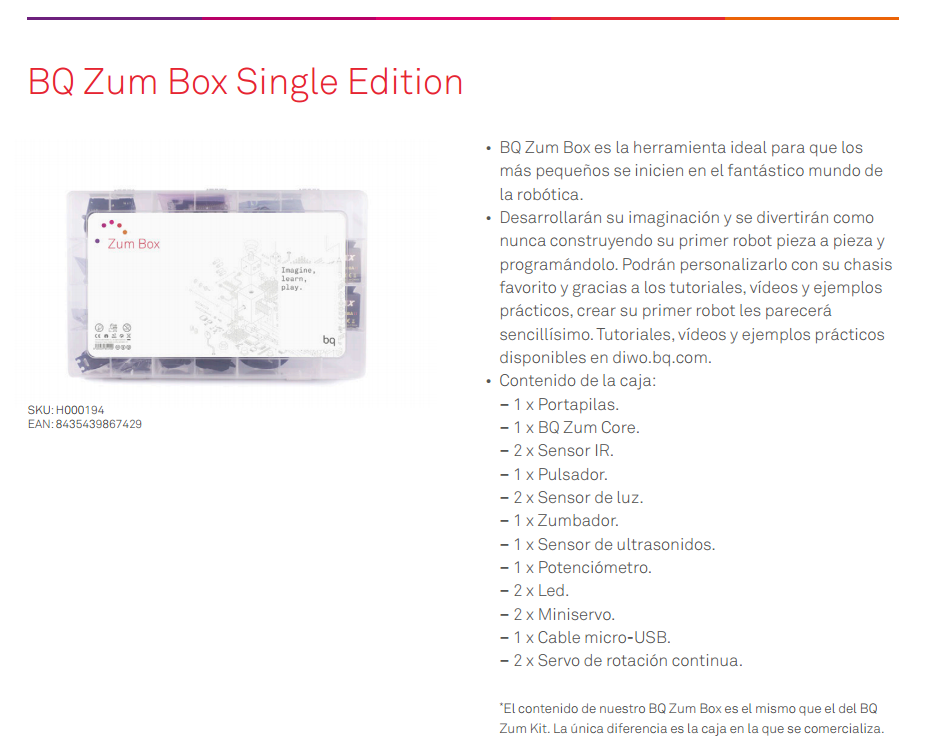
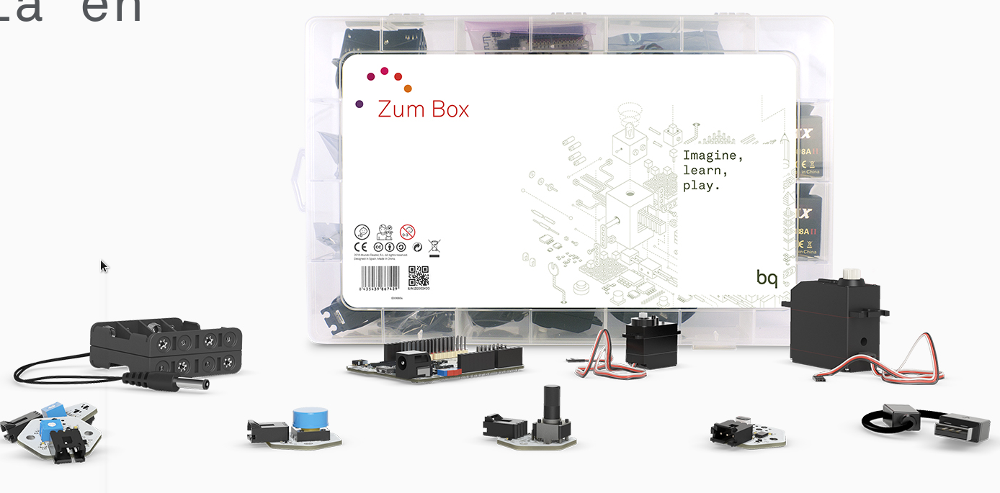

# Robotica Antequera

Curso de introducción a la robótica

CEP de Antequera

## [Programa](./README.md)

### José Antonio Vacas @javacasm

## [https://github.com/javacasm/RoboticaAntequera](https://github.com/javacasm/RoboticaAntequera)
# Componentes

## Kit

Vamos a usar el [kit de robótica de BQ](https://www.bq.com/es/zum-kit)

Precio 109,9 (aunque hacen descuento a centros educativos)

Con el podemos hacer un robot similar a este:

## Alternativas

* [Kit de iniciación barato para Arduino](http://www.luisllamas.es/2016/11/kit-de-iniciacion-barato-para-empezar-en-arduino/)

  

* [Kit de 24 sensores](http://tienda.bricogeek.com/kits-arduino/830-octopus-brick-kit-de-24-sensores-para-arduino.html)

  

* [Arduino Modules You Can Buy For Less Than $2 (each one)](http://randomnerdtutorials.com/21-arduino-modules-you-can-buy-for-less-than-2/)

* [20 Free Guides for Arduino Modules and Sensors](http://randomnerdtutorials.com/20-free-guides-for-arduino-modules-and-sensors/)

# Dónde comprar

## España

* http://www.electan.com
* http://www.leantec.com
* http://www.bricogeek.com
* http://www.cooking-hacks.com
* http://www.bq.com

## Internacional

* http://www.sparkfun.com
* http://www.adafruit.com
* http://arduino.cc

## Internacionales baratas

* http://www.elecfreaks.com/
* http://www.electrodragon.com/

## China

* http://www.dx.com
* http://www.aliexpress.com
* http://www.ebay.com
