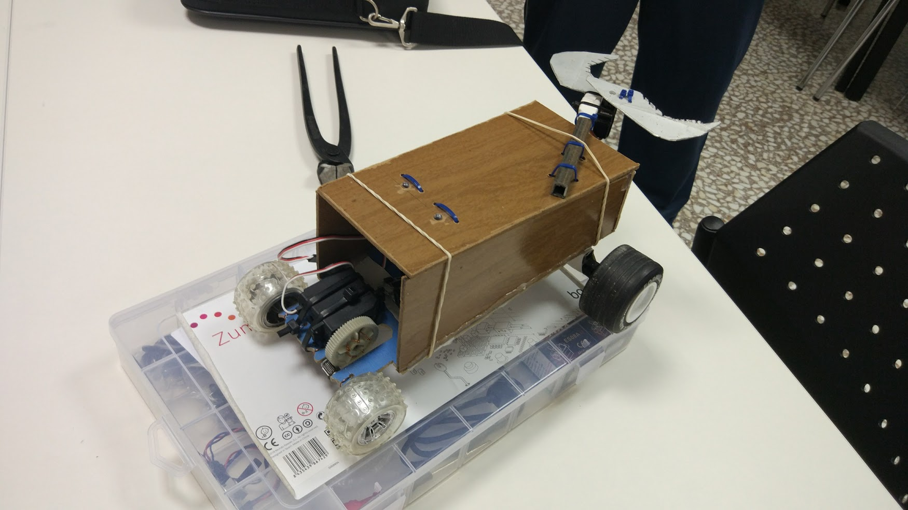

# Robotica Antequera 2018

Curso de introducción a la robótica (secundaria)

CEP de Antequera

## [Programa](./README.md)

### José Antonio Vacas @javacasm

## [https://github.com/javacasm/RoboticaAntequera18](https://github.com/javacasm/RoboticaAntequera18)

# Vampirobot

Medida de los componentes
Diseño en 3D (thinkercad)
Impresión
Prueba y error
Soluciones alternativas
Versiones con más o menos complejidad
Diferentes tareas para repartirlas: costura, documentación
Ellos trabajan bajo la guía del profesor
Publicación de resultados en internet para dar visibilidad https://www.youtube.com/watch?v=PFWEYES9_fY
Las herramienta son sencillas
Trabajan en grupos
4 horas
Ya sabían programar Scratch y diseñar
1º Bachillerato

# Avión radiocontrolado con movil

App Bluetooth controller
Plantillas que se recortan
Todos hacen todo
Ya sabían programar (AppInventor)
Instalación costosa en todos los ordenadores
5 horas
Blog: "Matematicas inteligentes" m4thacademy.blogspospot.es
1º ESO
¿Centro?

# Domótica
Controlamos una persiana con sensores de infrarrojos
3 sesiones:
* 1a Sesión programación
* 2a pruebas
* 3a Proyecto
Integran la activad en un proyecto que ya estaban haciendo
3º ESO
Grupos de 3

# Robot siguelineas/esquiva obstáculos
2º Bachillerato
Programación
Una cosa es programar y otra poner encima de la mesa
Cuando se detecta un obstáculo se rodea
Emite sonidos según el estado (sirve como depuración)

# Cámara Frigorífica
1º FP Frío/Calor
Montaje de automatismo en una maqueta de cámara frigorífica
* Control de puerta con pulsador
* Luz de señalización
* Sonido indicando el estado
* Sensor para detectar que se está cerrando
* Motor (servo) para puerta
* Motor (servo) representando ventilador

# Materiales
* App: "arduino bluetooth"

# Tips
* Diseñar un escenario de test, se facilita mucho
	* Escenario (caja de carton)
	* Condiciones reproducibles

* Usar programación parametrizada (potenciómetro) para tiempos, umbrales
* Hacer un diagrama de estados
* Programación defensiva
* Variables/funciones con nombres claros

# Robot policia

Alumnos de 6º de primaria

Busca a los "cacos" que son Negros y no a los buenos (blancos)

* Piezas recicladas de radiocontrol
* Usamos hilo de cobre para conectar la pieza del servo con el engranaje
* Pinza que coge a los "cacos" accionada por servo

Mejoras:
* Hacer una lista de funcionalidades y elegir las que vamos a hacer
* Definir los requisitos y las funcionalidades previamente
* Definir y repartir tareas
* Ir mejorando el modelo con iteraciones

# Rover Marciano

3º ESO, 6 grupos de 3 nños

* Hecho en los recreos
* Basado en los planos del robot de lego
* Detecta obstáculos
* Trabajando en equipos

#

El cole ha apostado por la robotica y ha comprado varios kits

# Seguidor Solar

Panel solar
Programación base por el profe
Grupo de 4 alumnos de 1° FP básica
Placa solar y seguidor
2 ldrs para seguir el sol
Inicialmente iba a moverse según el tiempo
En función de la diferencia de los valores se mueve
Hicieron una puesta a punto
Lo placa recarga un batería con la que se alimenta todo el sistema
Propuesta de poner a la entrada del centro
