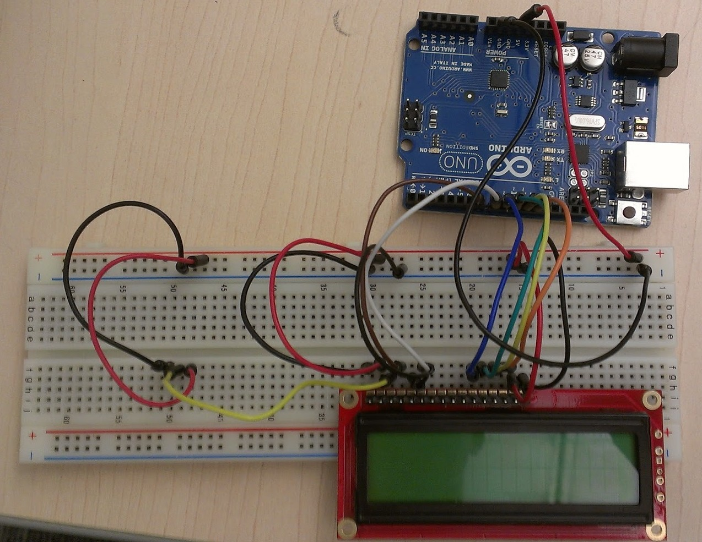

# Robotica Antequera 2018

Curso de introducción a la robótica (secundaria)

CEP de Antequera

## [Programa](./README.md)

### José Antonio Vacas @javacasm

## [https://github.com/javacasm/RoboticaAntequera18](https://github.com/javacasm/RoboticaAntequera18)

## La robótica como excusa

Todo lo relacionado con la robótica engancha,  eso es indudable
( pero puedes volver a leer todo pensando en la elaboración de una gran paella para invitar a los padres, casi todos los puntos vuelven a ser aplicables…)

Con la excusa de la robótica como gancho podemos enseñar y aprender todo tipo de contenidos.

En abstracto:

* Trabajo en equipo,
* División en grupos de trabajo con reparto de tareas y responsabilidades.
* Elaboración de documentación
   * Documentación técnica
   * Explicación más "llana" para la familia y los amigos
   * Presupuestos
   * Correspondencia comercial
* Uso de herramientas para gestionar y compartir información
* Exposición del trabajo realizado
* Relación con el mundo: proveedores, desarrolladores, otros grupos que ya lo han hecho
* Valoración de la ventaja de compartir información y experiencias
* Trabajo con problemas y proyectos complejos
* Aprender a superar la frustración

En concreto:

* Elección del modelo de robot a realizar:  búsqueda y selección de información, de comunidades que ya lo han montado…
* A partir del diseño de un robot tendremos que buscar  documentación (que probablemente estará en inglés). Haremos una documentación interna.
* Pedir información a otras comunidades
* Elaboración de un presupuesto para lo que podemos utilizar herramientas ofimáticas cómo hojas de calculo. Mejor si sus presupuesto es pequeño y tienen que agudizar el ingenio
* Buscar patrocinadores
* Estudio de la "física" y "geometría" del robot:
     * Sus movimientos y limitaciones
     * Cómo ve el mundo
* Compra de los materiales
* Montaje y pruebas
* Ciclo de iteración y mejora
* Habrá problemas y tendrán que buscar soluciones

# Problemas y sus soluciones

## El coste

Uno de los problemas que se plantea cuando se quiere hacer robótica en el aula es que tiene el coste y que normalmente los centros no disponen de presupuesto para ello.
En ese punto siempre aparece la disyuntiva de si usar un kit o los componentes

Por un lado un kit es sencillo de usar pero costoso

Por otro lado los componentes son baratos pero difíciles de usar

Una posible solución consiste en  involucrar a distintos niveles con distintas capacidades y dándoles tareas con distinto nivel de dificultad

Al construir el kit estamos aprendiendo electrónica, soldadura, impresión 3D, a leer esquemas,.... y estamos fabricando los componentes que pueden usar los más pequeños
